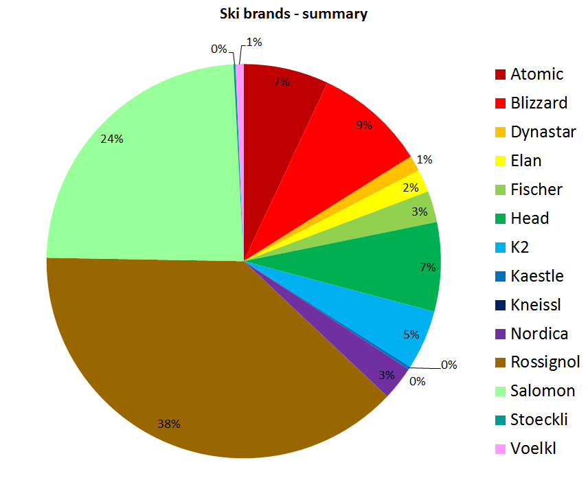
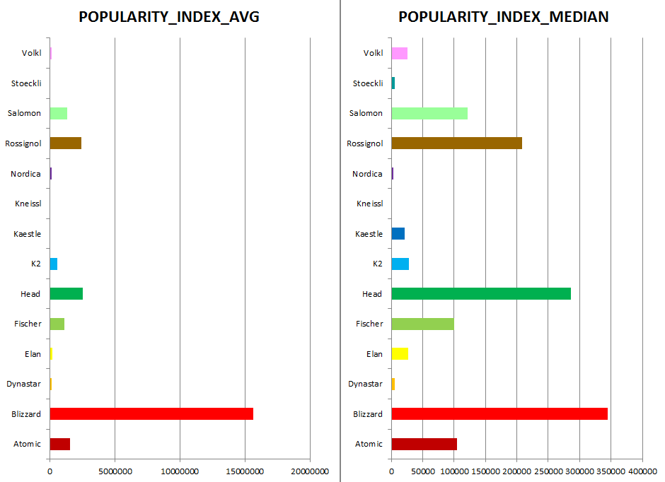
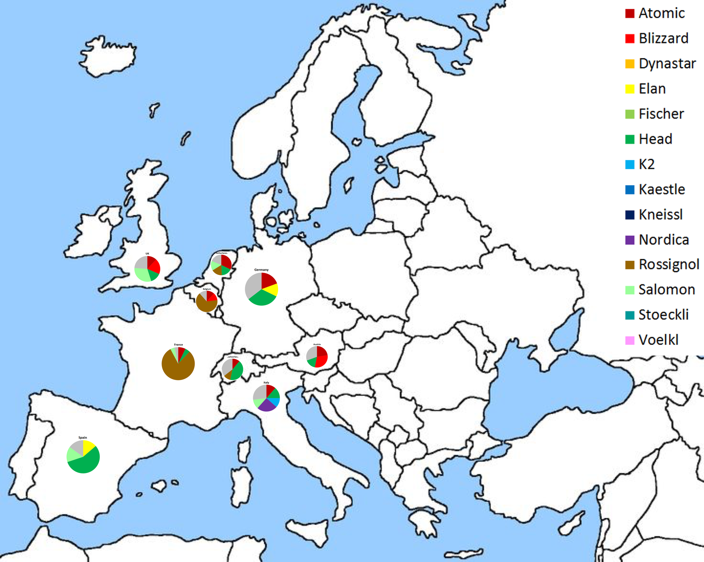
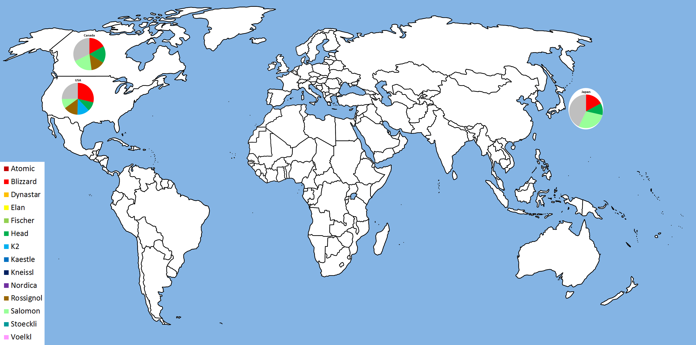
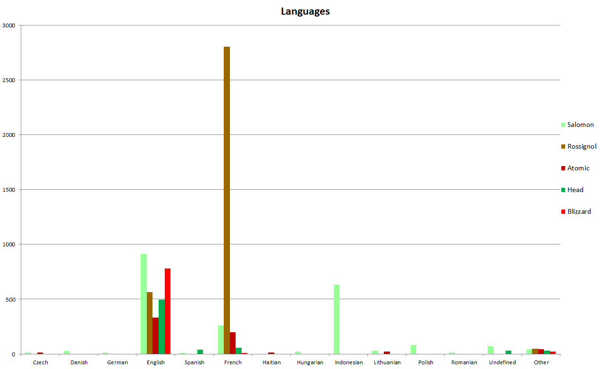
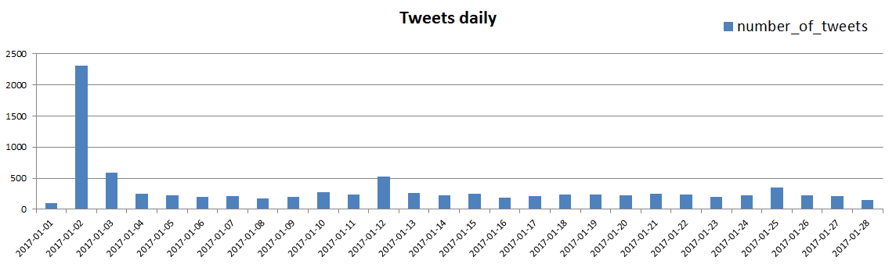
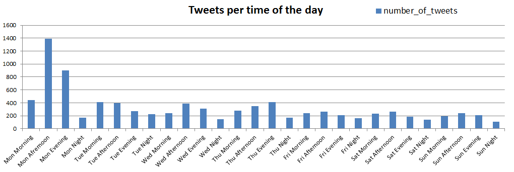
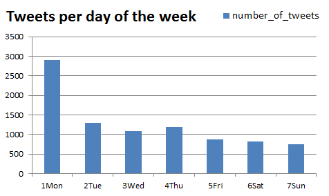
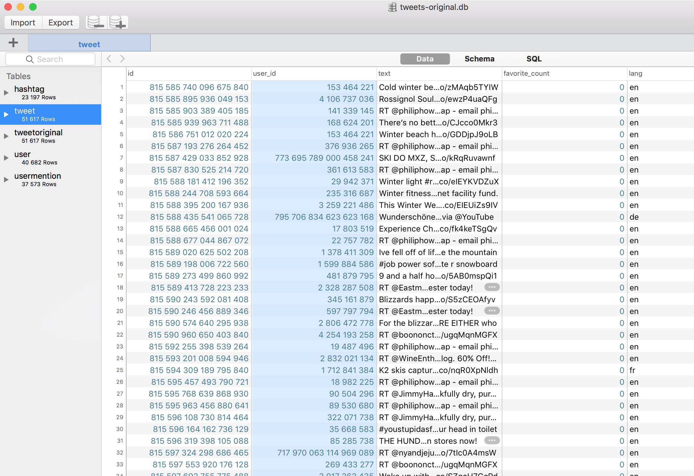

# myskibrands

## Sentiment analysis of alpine ski brands on Twitter

The project has been performed during [Tech Leaders Mentoring Program](https://techleaders.eu). In order to analyze the data I have used following tools: Python and PyCharm, SQL and Datum, Excel and Tableau Software.

Thanks to the service ranker.com and Wikipedia I have identified 14 most popular downhill ski brands. Their names have been tracked as keywords, for example "Rossignol", "Salomon", "Atomic" or "Head”. It was necessary to also define helping keywords connected to skiing, because some of them can be understood in two ways ("atomic", "blizzard", "head").

## The most popular brands

First analysis of 8,923 tweets shows that the most popular brand in investigated time, which was 01-28 Jan 2017, was Rossignol, the second one was Salomon.

To investigate the real impact of tweets on publicity I have created a popularity index, which is a product of number of tweets and an average or median of followers number of users who published the tweets. Results show that there are a few brands which have quite wide scope, like Blizzard, Head, Rossignol, Salomon, Fischer and Atomic.

## Ski brands in different countries

Maps below present the most popular ski brands in different countries.

Twitter users used a lot of languages in posts about ski brands. The most of tweets were in English, but for example Rossignol was tweeted mostly in French. Quite popular brand Salomon was tweeted in 26 different languages, among others English, Indonesian, French, Polish, Lithuanian. You can also observe Haitian language in Atomic tweets. In fact, it's only client-defined system language, but the tweets themselves were actually in English and have been tweeted from New York or from Switzerland.

## Time of posting

The results can be surprising. For example, my first hypothesis was that the users post tweets about ski mainly on weekends, maybe mainly afternoons or evenings. Well, not exactly. The number of tweets was even in each day (ca 200 tweets daily) apart from 02 Jan 2017 when 2,314 tweets have been posted. The users were significantly more active on Monday afternoons and evenings (normalized to their timezones).

## Data quirks

Apart from the two already mentioned problems (user's defined language vs. actual language of a tweet; incorrect assumptions and hypotheses) there were other problems with the database:

1. I have collected 51,617 tweets alltogether and only 8,923 (17%) of them were suited for analysis. The database at the beginning was full of useless data and it was not easy to filter the valid items. It was mainly caused by ambiguous keywords and spam accounts.
2. There are some disparities which make an analysis much harder, for example, there is one tweet which has been retweeted 2,671 times (which is almost 30% of the whole analyzed database): "RT @Cdiscount: JEU #RT + Follow pour tenter de gagner un capteur d'activité multisport ski Rossignol @PIQLive !..." It means: "RT @Cdiscount: GAME #RT + Follow to try to win a multisport activity sensor ski Rossignol @PIQLive!..." 92% of all Rossignol tweets in France is this advertising tweet.
3. Other example for disparity: one extremely active user posted 1,537 tweets and 1,435 of them were for Salomon, which is 67% of all tweets for this brand.

